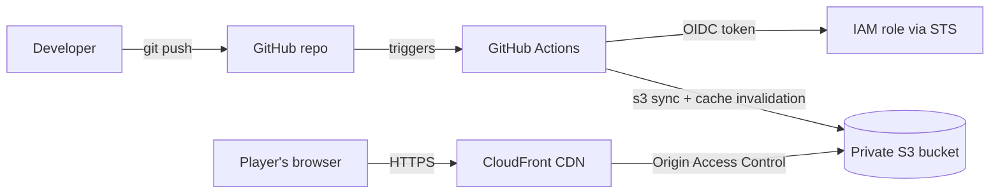

# Wordle on AWS: Static Site with a Keyless CI/CD Pipeline

A browser-based Wordle game (HTML, CSS, JavaScript) hosted on AWS and deployed automatically with GitHub Actions. Every push to `main` updates the live site with no manual uploads and no stored AWS credentials.

**Live demo:** https://dgnzzur6x529u.cloudfront.net

## Why this project

A single static page doesn't need AWS. GitHub Pages would be simpler. I chose AWS on purpose to practice production-style infrastructure: private storage behind a CDN, least-privilege IAM, keyless deployments with OIDC, and cost controls.

## Architecture

| Component | Role |
|---|---|
| **S3** | Stores the site files. Block Public Access is on, so the bucket is fully private. |
| **CloudFront** | Serves the site over HTTPS from edge locations. The only principal allowed to read the bucket. |
| **Origin Access Control** | Bucket policy restricts `s3:GetObject` to this one CloudFront distribution. |
| **GitHub Actions** | On push to `main`, syncs files to S3 and invalidates the CloudFront cache. |
| **IAM OIDC role** | GitHub assumes a role with short-lived credentials. No access keys are stored anywhere. |
| **IAM admin user + MFA** | Day-to-day work uses an IAM user with MFA, not the root account. |
| **AWS Budgets** | Monthly cost alert as a safety net. |

## Key design decisions

- **Private bucket + Origin Access Control** instead of public static website hosting, so files can only be reached through CloudFront.
- **OIDC instead of long-lived access keys.** GitHub requests a short-lived token, and AWS trusts it only for this specific repo and the `main` branch.
- **Least-privilege deploy policy.** The deploy role can only write to one bucket and invalidate one distribution.
- **No root usage.** Root is locked down with MFA and not used for daily work.
- **Bucket versioning enabled** so a bad deploy can be rolled back.

## Deployment flow

1. Edit files locally and test in the browser.
2. `git add . && git commit -m "message" && git push`
3. GitHub Actions assumes the IAM role via OIDC.
4. `aws s3 sync` uploads the changes, and `--delete` keeps the bucket an exact mirror of the repo.
5. A CloudFront invalidation clears cached copies so visitors get the new version.

The workflow lives in [`.github/workflows/deploy.yml`](.github/workflows/deploy.yml).

## Challenges and what I learned

**1. OIDC trust policy failing with `AssumeRoleWithWebIdentity` errors.**
The trust policy looked correct but every run failed. I added a temporary debug step to print the token's claims and found GitHub was sending an ID-based `sub` claim (`repo:owner@<id>/repo@<id>:ref:...`) instead of the classic `repo:owner/repo:...` format. Updating the trust policy to match fixed it. Lesson: when authentication fails, inspect what is actually being sent rather than what you assume is being sent.

**2. Laggy guess submission.**
Using Chrome DevTools, I traced the lag to a call to a free third-party dictionary API on every guess. The API was unreliable, so I removed the dependency. The game now runs entirely in the browser.

**3. Git workflow.**
Editing a file on GitHub's website created a commit my local copy didn't have, which caused a rejected push. Fixed with `git pull`. I now edit locally and push.

## Estimated cost

At personal-project traffic, S3 storage and CloudFront transfer are expected to stay within free-tier or pennies-per-month levels. A budget alert is configured to catch anything unexpected.

## Possible next steps

- Custom domain with Route 53 and an ACM certificate
- Rebuild the infrastructure as code with Terraform
- Add a valid-word list for real word validation

## Run locally

Open `board.html` in a browser. No build step or server is required.

## Tech

HTML, CSS, JavaScript, Amazon S3, Amazon CloudFront, AWS IAM (OIDC), GitHub Actions
